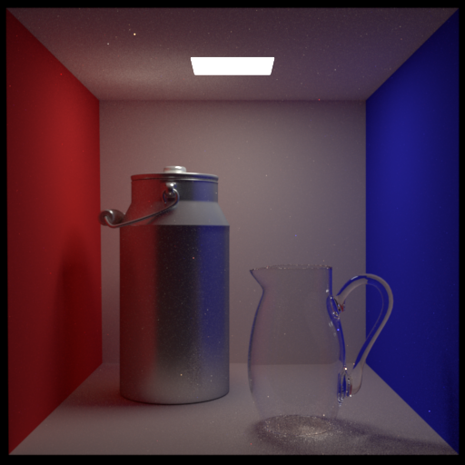
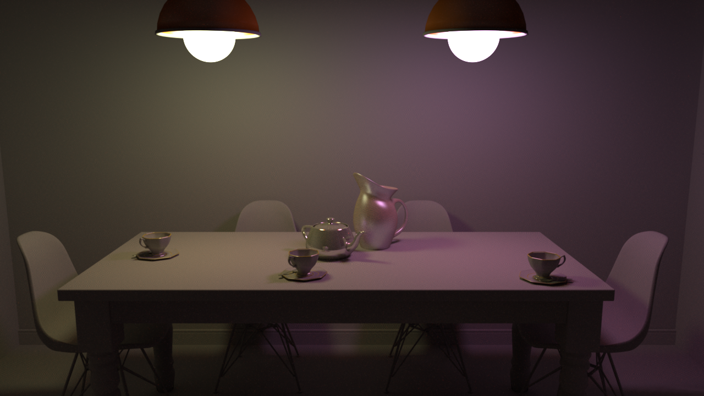
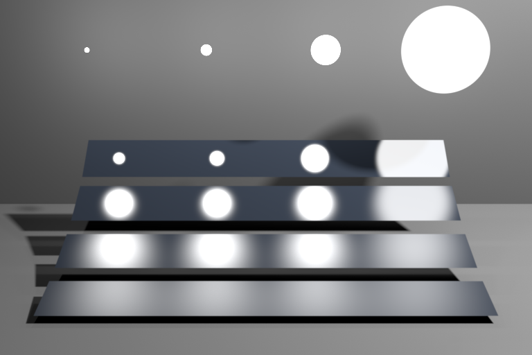

# Computer Graphics 2019 Winter

## Project Requirements
You are required to implement a simple **c++** realistic rendering engine using standard path tracing algorithm. **And you must test your rendering results using the 3 scenes below and 1 scene created by yourself**. Some requirements and hints of this project are listed below:
+ **Camera Config**: A standard pinhole camera is in **right-handed coordinate system** and can be defined using the following parameters:
    - *Position*:  The camera position is basically a vector in world space that points to the camera's position.
    - *LookAt*: The target point in world space that the camera face forward. So the forward *direction* vector as z-axis of camera can be calculated by normalizing *LookAt-Position*.
    - *Up*: The y-axis of camera.
    - *Fov*: The view angle(in degree) on the y-axis of camera.
    - *Film Resolution*: The resolution of your camera sensor, usually is rectangular e.g. 1280*720.
+ **Scene Geometry**: Scene geometries are also placed in **right-handed world coordinate system**. We use .obj file to store scene geometry data in **triangle mesh**. You can view or edit scene using [Maya](https://www.autodesk.com/products/maya/overview) or other tools.
Besides, you can implement other shapes like quad, sphere, box, cylinder for bonus.
+ **Material Description**: You are required to implement at least 3 kinds of different materials listed below. Other more complex materials are optional. **Since the .mtl file using *Phong format*, some fields are not in use. You must convert those parameters to BSDFs correctly.**  
    - *Diffuse*: **kd** is the diffuse reflectance.
    - *Glossy*: Glossy BSDF is a mixture of phong lobe and diffuse lobe. **kd** is the diffuse reflectance. **ks** is the specular reflectance, **Ns** is the exponent of phong lobe.
    - *Transparent*: Transparent BSDF can show the refraction effect of glass or water. **Ni** is the index of refraction.
+ **Light**: Test scenes are illuminated by area light. You can directly use triangle mesh tagged with "light" in .obj as area light or design your own interface using other shapes like quad or sphere. We use **ka** in .mtl to store the emittance of light source.

+ **Samples per Pixel(spp)**: In path tracing, a sample represent a path generated from camera. Usually, an image with more spps can always converge to a better result. 
+ **Standard Rendering Result**: As ground truth, all the standard rendering results are rendered at 2048 spp and stored in .exr format[(Openexr)](https://www.openexr.com/). You can compare your own results with the ground truth image.
## 1. Cornell Box

### Camera Config
+ *Position*=vec3(278, 273, -800) 
+ *LookAt*=vec3(278, 273, -799)
+ *Up*=vec3(0, 1, 0)
+ *Fov*=39.3077
+ *Film Resolution*=512*512

### Standard Rendering Result

## 2. Dinning Room

### Camera Config
+ *Position*=vec3(-0.5, 3, 5.5) 
+ *LookAt*=vec3(-0.5, 2, 0)
+ *Up*=vec3(0, 1, 0)
+ *Fov*=60
+ *Film Resolution*=1280*720

### Standard Rendering Result

## 3. Veach MIS

### Camera Config
+ *Position*=vec3(0, 2, 15) 
+ *LookAt*=vec3(0, -2, 2.5)
+ *Up*=vec3(0, 1, 0)
+ *Fov*=28
+ *Film Resolution* =768*512

### Standard Rendering Result

## Third Party Libraries
You are highly recommended to use the following third party libraries:
+ [**glm** for 3D math computations.](https://github.com/g-truc/glm)
+ [**tinyobj** for loading obj models.](https://github.com/syoyo/tinyobjloader)